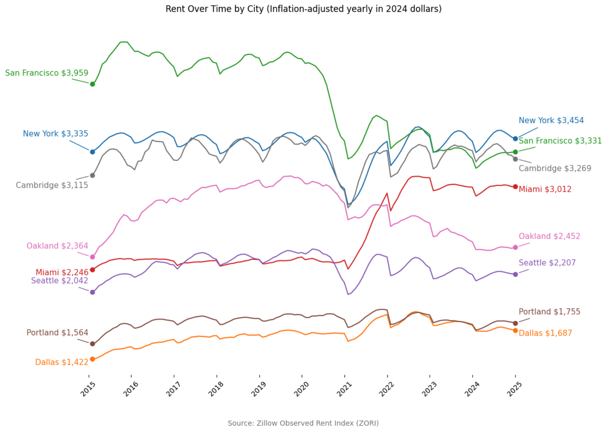

# 📊 Rent Affordability Trends in U.S. Cities (2015–2025)

This notebook explores historical rent trends across major U.S. cities using Zillow’s public ZORI dataset. I focused on cities I’ve lived in (Brooklyn, Oakland, SF, etc.) and those affected by pandemic-era migration (Portland, Miami, Seattle) to understand how affordability has shifted — especially after adjusting for inflation.


## 🧠 Key findings
- **San Francisco** rents have cratered since their pre-COVID peak (down nearly a third).
- **Miami** rents have surged dramatically — up almost as much as SF is down.
- **Oakland** boomed during the pandemic, then crashed hard — a “boom and bust” trajectory.
- **Most other cities** (e.g. Portland, Dallas, Seattle) have stayed relatively stable when adjusted for inflation.
- Adjusting for inflation significantly changes the narrative around rising rents — useful context for renters, policymakers, and housing advocates.

## 📈 Sample Result




## 🛠 Skills demonstrated
- Data cleaning & reshaping with `pandas`
- Inflation adjustment using the `cpi` package
- Data visualization with `matplotlib` & `seaborn`
- Communicating insights through storytelling

## 📁 Dataset
- Source: Zillow ZORI (Zillow Observed Rent Index): https://www.zillow.com/research/data/ 
- Monthly rent estimates for 1-bedroom units, 2015–2025

## 🧩 Limitations

- ZORI is an estimate — other rent metrics may show different trends.
- CPI adjustment uses national averages, not local inflation rates.
- City boundaries vary significantly (e.g. Dallas includes suburbs; SF does not).

---

## 🧪 Future Work

- Adjusting monthly data with monthly CPI instead of yearly averages
- Normalizing by average unit square footage to assess price per sq. ft.
- Incorporating income data to evaluate rent burden, not just price level


## ▶️ How to Run This Project

1. Clone this repo:
   ``` bash
   git clone https://github.com/bourqui/rent-affordability-over-time.git
   cd rent-affordability-over-time
   
2. Install the required packages (recommend using a virtual environment):
```pip install -r requirements.txt```

3. Open the notebook:
`jupyter notebook exploratory_notebook.ipynb`

_Optional: Use Cusor or another modern editor that supports Jupyter notebooks directly._

# About me
I'm Martin! You can learn more about me at [martinbourqui.com](https://www.martinbourqui.com).